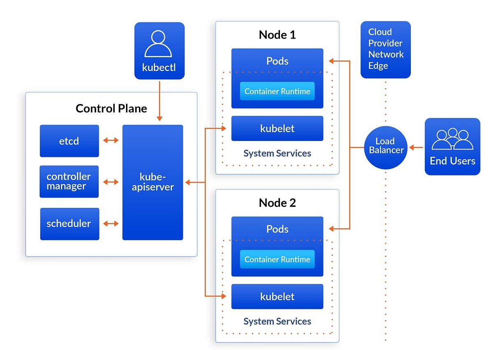

# Kubernetes Developer Knowledge

---

## Introduction

Kubernetes (often abbreviated as K8s) has completely transformed the world of container orchestration.  
It has become the de facto standard for automating the deployment, scaling, and management of containerized applications.  
Whether you’re a DevOps engineer, a cloud architect, or a developer moving toward microservices, understanding Kubernetes is essential for managing today’s cloud-native infrastructure.

This guide covers 30 essential Kubernetes concepts — a mix of theory and practical insights — that every software engineer and DevOps professional should know.  
By the end, you’ll not only understand what each concept is, but also why it matters and how it’s applied in real-world environments.

---

## Kubernetes Architecture Overview

At a high level, Kubernetes follows a **master–worker (control plane–node) architecture**.

- **Control Plane:** Manages the cluster, making global decisions and maintaining desired state.
- **Worker Nodes:** Run the actual application workloads inside containers.

---

### Control Plane Components

| Component            | Description                                                        |
|----------------------|--------------------------------------------------------------------|
| Kube API Server      | Acts as the front door of Kubernetes; exposes APIs for cluster management. |
| etcd                 | A distributed, consistent key-value store that keeps all cluster data.      |
| Controller Manager   | Monitors the cluster and reconciles actual vs. desired state.              |
| Scheduler            | Decides which node a Pod should run on.                                   |

---

### Worker Node Components

| Component        | Description                                         |
|------------------|-----------------------------------------------------|
| Kubelet         | An agent on every node ensuring containers are healthy and running. |
| Kube Proxy      | Manages networking and load-balancing inside the cluster.           |
| Container Runtime| (Docker, containerd, CRI-O) responsible for running containers.    |

---

## 🧱 Kubernetes Architecture Diagram



---

## ⚙️ Core Kubernetes Concepts

### 1. Container

Containers are lightweight, portable, and consistent environments that package applications and their dependencies together.  
They ensure your app runs the same way across different systems — from your laptop to production servers.

**Real-world example:**  
A Node.js web application containerized using Docker can run on any Kubernetes node, ensuring predictable behavior across environments.

---

### 2. Container Orchestration

Container orchestration is the automation of deploying, managing, scaling, and networking containers.  
It abstracts infrastructure complexity and allows applications to run reliably in clusters.

**Real-world example:**  
Kubernetes automates container management — scaling apps up when load increases and healing them when a node fails.

---

### 3. Kubernetes (K8s)

Kubernetes is an open-source orchestration system that provides a unified API for managing containers at scale.  
It’s designed for high availability, fault tolerance, and scalability.

**Real-world example:**  
Large companies like Spotify, Airbnb, and Lyft use Kubernetes to run thousands of microservices in production environments.

---

### 4. Core Building Blocks of Kubernetes

The key objects that make up Kubernetes include:

- **Pods** (smallest deployable unit)
- **ReplicaSets** (ensure desired Pod counts)
- **Deployments** (manage updates and rollbacks)
- **Services** (expose Pods to network traffic)
- **ConfigMaps/Secrets** (inject configuration and credentials)
- **PersistentVolumes** (provide durable storage)

**Example:**  
A Deployment defines your app and how many Pods should run. If one Pod fails, the ReplicaSet ensures a new one is created automatically.

---

### 5. Kubernetes Architecture Explained

Kubernetes operates as a cluster of nodes.

- The Control Plane (master components) manages cluster state.
- Worker Nodes host workloads as containers.

This separation allows Kubernetes to self-heal, scale dynamically, and manage workloads declaratively.

**Real-world example:**  
A cloud-based cluster in AWS EKS or Google GKE uses managed control planes while worker nodes run containerized workloads.

---

### 6. Kube API Server

The API Server is the gateway to Kubernetes.  
It processes all REST API calls (from CLI, dashboards, or other controllers) and communicates with etcd.

**Real-world example:**  
When you run `kubectl get pods`, it queries the API Server, which retrieves the Pod information from etcd.

---

### 7. etcd

etcd is a distributed, key-value database that stores cluster data — configurations, states, and metadata.  
It ensures consistency across all nodes and supports leader elections within the control plane.

**Real-world example:**  
etcd stores definitions for Pods, Deployments, and Services. If it’s corrupted, the cluster loses its state.

---

### 8. Kube Controller Manager

This component runs controllers — processes that monitor the cluster and reconcile differences between desired state and actual state.

**Real-world example:**  
If a node crashes, the Node Controller notices it and recreates the Pods on another node.

---

### 9. Kube Scheduler

Responsible for deciding which node each Pod should run on, based on CPU/memory requirements, affinities, and taints/tolerations.

**Real-world example:**  
When you deploy an NGINX Deployment, the Scheduler evaluates available nodes and assigns Pods to the optimal node.

---

### 10. Kubelet

The Kubelet runs on every worker node.  
It ensures that containers described in Pod manifests are running and healthy.

**Real-world example:**  
If a Pod’s container crashes, Kubelet restarts it automatically.

---

### 11. Kube Proxy

Manages network routing between Pods and Services across nodes.  
It maintains network rules to route requests internally or externally.

**Real-world example:**  
Kube Proxy ensures traffic to a Service is evenly distributed among its backend Pods.

---

### 12. Pod

A Pod represents a single instance of a running process in the cluster.  
It can contain one or more containers that share storage, networking, and lifecycle.

**Example YAML:**
```yaml
apiVersion: v1
kind: Pod
metadata:
  name: my-pod
spec:
  containers:
  - name: nginx
    image: nginx:latest
    ports:
    - containerPort: 80
```

---

### 13. YAML

Kubernetes uses YAML files to define objects declaratively.  
You specify what you want (desired state), and Kubernetes ensures that’s what runs.

**Real-world example:**  
A `deployment.yaml` file defines replicas, labels, and container images for your app.

---

### 14. ReplicaSet

A ReplicaSet ensures a defined number of identical Pods are running.  
If any Pod dies, it creates a new one automatically.

**Real-world example:**  
A ReplicaSet of 3 ensures that your frontend app always has 3 running instances.

---

### 15. Deployment

A Deployment manages ReplicaSets and supports rolling updates and rollbacks.

**Example YAML:**
```yaml
apiVersion: apps/v1
kind: Deployment
metadata:
  name: web-deployment
spec:
  replicas: 3
  selector:
    matchLabels:
      app: web
  template:
    metadata:
      labels:
        app: web
    spec:
      containers:
      - name: nginx
        image: nginx:1.23
        ports:
        - containerPort: 80
```

**Real-world example:**  
When you update the image version, Kubernetes performs a rolling update, ensuring zero downtime.

---

### 16. Services (ClusterIP, NodePort, LoadBalancer)

Services expose Pods to the network.

- **ClusterIP:** Internal communication.
- **NodePort:** External access via node ports.
- **LoadBalancer:** External access with cloud provider integration.

**Real-world example:**  
Expose your app with a LoadBalancer so external users can reach it.

---

### 17. Namespaces

Namespaces logically separate resources within a cluster.  
They help manage multiple environments or teams in the same cluster.

**Real-world example:**  
`dev`, `staging`, and `prod` namespaces can each have their own Deployments and Services.

---

### 18. Imperative vs Declarative Management

- **Imperative:** Command-based (you specify how).
- **Declarative:** Configuration-based (you specify what).

**Example:**
- Imperative: `kubectl run nginx --image=nginx`
- Declarative: `kubectl apply -f nginx-deploy.yaml`

Declarative management is preferred for automation and version control.

---

### 19. Manual Scheduling

Normally, the Scheduler assigns Pods automatically.  
With manual scheduling, you specify the node explicitly.

**Example YAML:**
```yaml
spec:
  nodeName: node1
```

**Use case:** Running specific Pods on specific hardware nodes.

---

### 20. Labels

Labels are key-value pairs attached to objects for organization and filtering.

**Example:**  
`kubectl get pods -l environment=prod` lists all production Pods.

---

### 21. Selectors

Selectors use labels to filter objects for grouping or targeting.

**Example YAML:**
```yaml
selector:
  matchLabels:
    app: frontend
```

Used in Services, ReplicaSets, and Deployments.

---

### 22. Taints and Tolerations

Control which Pods can run on which nodes.  
A taint repels Pods unless they have a matching toleration.

**Example:**

Apply taint:
```shell
kubectl taint nodes db-node db=required:NoSchedule
```

Pod toleration:
```yaml
tolerations:
- key: "db"
  operator: "Equal"
  value: "required"
  effect: "NoSchedule"
```

---

### 23. Node Affinity

Node Affinity ensures Pods run on nodes with specific labels.

**Example YAML:**
```yaml
affinity:
  nodeAffinity:
    requiredDuringSchedulingIgnoredDuringExecution:
      nodeSelectorTerms:
      - matchExpressions:
        - key: gpu
          operator: In
          values:
          - "true"
```

**Use case:** Schedule AI workloads only on GPU nodes.

---

### 24. Resource Requests and Limits

Define minimum and maximum CPU/memory per container.  
Prevents overuse and ensures fair scheduling.

**Example YAML:**
```yaml
resources:
  requests:
    cpu: "250m"
    memory: "256Mi"
  limits:
    cpu: "500m"
    memory: "512Mi"
```

---

### 25. DaemonSets

Ensures a Pod runs on every node (or a subset).

**Example:**  
Deploy monitoring agents like Prometheus Node Exporter across all nodes.

---

### 26. Static Pods

Static Pods are managed directly by Kubelet, not the control plane.

**Use case:**  
Critical system Pods (like kube-proxy or monitoring agents) on master nodes.

---

### 27. Multiple Schedulers

You can run multiple schedulers for specialized workloads.

**Example:**  
A custom scheduler handles batch jobs separately from standard workloads.

---

### 28. Logging and Monitoring

Logging and monitoring are vital for observability and reliability.  
Kubernetes integrates with tools like Prometheus, Grafana, and ELK Stack.

**Example:**  
Collect Pod logs via Fluentd and visualize metrics with Grafana dashboards.

---

### 29. Monitoring Cluster Components

Monitor critical components (API server, etcd, kubelet, kube-proxy).  
Helps detect latency, failures, or bottlenecks early.

**Tools:** Prometheus, Grafana, Lens, Datadog.

---

### 30. Metrics

Kubernetes exposes rich metrics via the Metrics Server or Prometheus.  
These metrics help track CPU, memory, and network usage.

**Example:**  
Use `kubectl top pod` to view live resource utilization.

---

# Helm Chart Example

Helm simplifies Kubernetes deployments by packaging YAMLs into reusable templates.

**Chart.yaml:**
```yaml
apiVersion: v2
name: demo-chart
version: 0.1.0
description: Simple NGINX deployment
```

**values.yaml:**
```yaml
replicaCount: 2
image:
  repository: nginx
  tag: latest
```

**templates/deployment.yaml:**
```yaml
apiVersion: apps/v1
kind: Deployment
metadata:
  name: {{ .Release.Name }}-deployment
spec:
  replicas: {{ .Values.replicaCount }}
  selector:
    matchLabels:
      app: {{ .Release.Name }}
  template:
    metadata:
      labels:
        app: {{ .Release.Name }}
    spec:
      containers:
      - name: nginx
        image: "{{ .Values.image.repository }}:{{ .Values.image.tag }}"
        ports:
        - containerPort: 80
```

---

## Summary

Kubernetes provides a robust platform for managing containerized applications at scale.  
Mastering these concepts will help you deploy, monitor, and maintain reliable cloud-native systems.  
Focus on Pods, Deployments, Services, ConfigMaps, Secrets, Namespaces, and networking for daily work, and explore advanced topics like Ingress, Autoscaling, and monitoring as you grow.

---